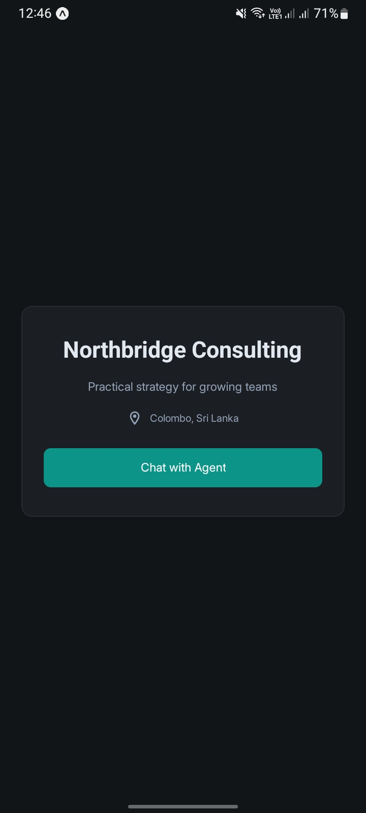
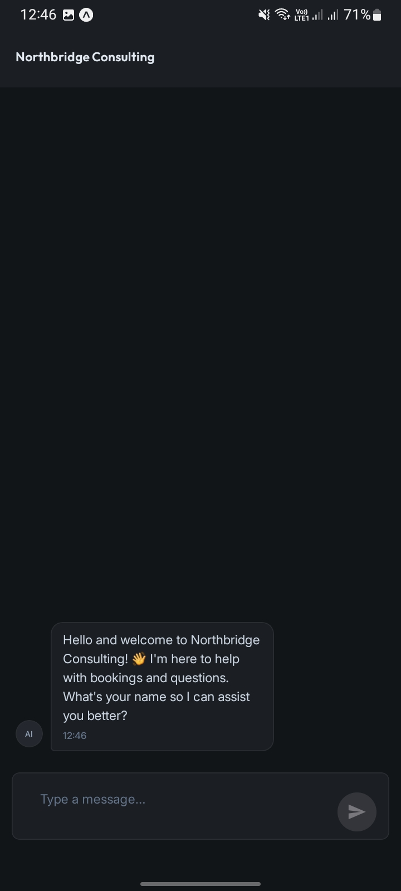
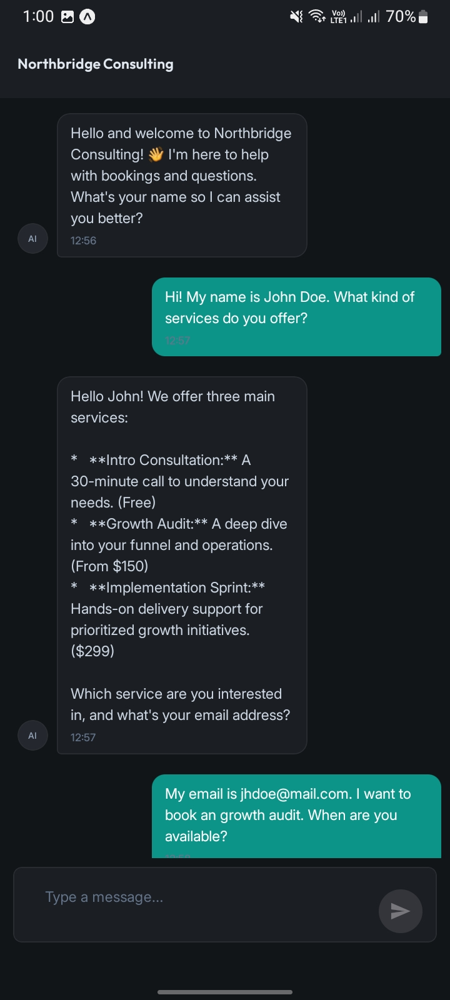
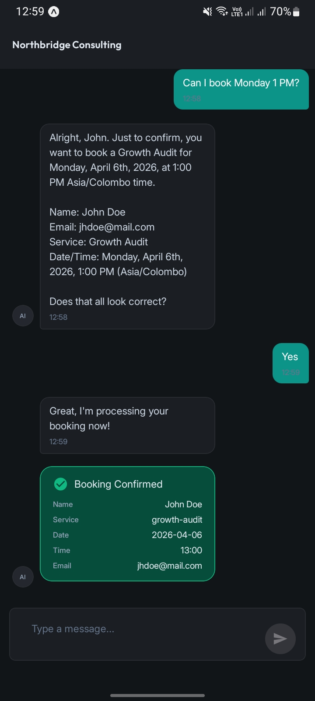

<p align="center">
  
</p>

<h1 align="center">BizAgent</h1>

<p align="center">
  <strong>AI-Powered Receptionist for Service-Based Businesses</strong>
</p>

<p align="center">
  <a href="#features">Features</a> •
  <a href="#demo">Demo</a> •
  <a href="#tech-stack">Tech Stack</a> •
  <a href="#architecture">Architecture</a> •
  <a href="#getting-started">Getting Started</a> •
  <a href="#configuration">Configuration</a> •
  <a href="#deployment">Deployment</a> •
  <a href="#contributing">Contributing</a> •
  <a href="#license">License</a>
</p>

<p align="center">
  
  
  
  
</p>

---

## Overview

BizAgent is a cross-platform mobile application that gives service-based small businesses — real estate agencies, dental clinics, consultancies, and more — a 24/7 AI-powered receptionist. Users interact with an intelligent chatbot that answers FAQs, qualifies leads, validates appointment availability, prevents double bookings, and writes confirmed appointments directly to a Google Sheet acting as a zero-cost CRM.

## Features

- **Conversational AI Booking** — Powered by Google Gemini 2.5 Flash, the chatbot guides users from inquiry to confirmed appointment in a single session
- **Lead Qualification** — Collects name, email, and desired service before booking
- **Smart Scheduling** — Validates against business hours and checks the Google Sheet for conflicts to prevent double bookings
- **Google Sheets CRM** — Every confirmed booking is appended as a new row (Name, Email, Service Type, Date/Time) — zero database cost
- **Prompt Injection Resistance** — System prompt guardrails keep the bot strictly in its receptionist role
- **Offline Resilience** — Failed bookings are cached locally via AsyncStorage and retried on next launch
- **Network Awareness** — Connection banner appears when offline; chat input is disabled until reconnected
- **Easy Client Onboarding** — Swap the business profile JSON and Google Sheet ID to deploy for a new client in minutes
- **Configurable Rate Limits** — Server-side sliding window rate limiting protects Gemini free-tier quotas (RPM / TPM / RPD)
- **Dark Mode by Default** — Slate Professional design with teal accent, crafted for a modern corporate aesthetic

---

## Showcase: Automatic Google Sheets Integration

Watch how the AI handles the conversation to book an appointment, and how it seamlessly syncs the confirmed booking directly into the business's Google Sheet in real-time.

[Google-Sheet-Preview](https://github.com/user-attachments/assets/f5ba4dc8-98b4-48df-9f0e-1f7659d7d6a2)

---

## Demo

| Landing Screen | Chat Greeting | Chat Conversation |
|:-:|:-:|:-:|
|  |  |  |

| Continue Conversation | Booking Confirmed |
|:-:|:-:|
|  |  |

---

## Tech Stack

| Layer | Technology |
|---|---|
| **Mobile Client** | React Native 0.81 · Expo SDK 54 · TypeScript · React 19 |
| **UI Framework** | React Native Paper (Material Design 3) · react-native-gifted-chat |
| **State Management** | React Context + `useReducer` |
| **Backend** | Node.js 24 · Express 5 · Vercel Serverless Functions |
| **AI** | Google Gemini 2.5 Flash (`@google/genai`) |
| **Database** | Google Sheets API (`google-spreadsheet`) |
| **Auth** | Google Service Account · API Key (`X-API-Key` header) |
| **Infrastructure** | Vercel Hobby (free) · Expo Go / EAS Build |

---

## Architecture

```
┌──────────────────┐         HTTPS          ┌─────────────────────────┐
│                  │ ◄────────────────────►  │   Vercel Serverless     │
│   React Native   │    POST /api/chat       │                         │
│   Expo Client    │    POST /api/book       │  ┌──────────────────┐   │
│                  │    GET  /api/health      │  │  Express Router  │   │
│  ┌────────────┐  │                         │  └────────┬─────────┘   │
│  │ AppContext  │  │                         │           │             │
│  │ useReducer │  │                         │  ┌────────▼─────────┐   │
│  └────────────┘  │                         │  │   Rate Limiter   │   │
│                  │                         │  └────────┬─────────┘   │
│  ┌────────────┐  │                         │           │             │
│  │ AsyncStore │  │                         │  ┌────────▼─────────┐   │
│  │  (retry)   │  │                         │  │   Gemini 2.5     │   │
│  └────────────┘  │                         │  │   Flash API      │   │
└──────────────────┘                         │  └────────┬─────────┘   │
                                             │           │             │
                                             │  ┌────────▼─────────┐   │
                                             │  │  Google Sheets   │   │
                                             │  │  API (CRM)       │   │
                                             │  └──────────────────┘   │
                                             └─────────────────────────┘
```

---

## Getting Started

### Prerequisites

- [Node.js](https://nodejs.org/) v24 LTS
- [Expo CLI](https://docs.expo.dev/get-started/installation/) (`npm install -g expo-cli`)
- [Vercel CLI](https://vercel.com/docs/cli) (`npm install -g vercel`) — for backend local dev
- A Google Cloud project with the **Google Sheets API** enabled
- A Google **Service Account** with editor access to a target spreadsheet
- A [Google AI Studio](https://aistudio.google.com/) API key for Gemini 2.5 Flash

### Installation

1. **Clone the repository**

   ```bash
   git clone https://github.com/RusithHansana/biz-agent-react-native.git
   cd biz-agent-react-native
   ```

2. **Install client dependencies**

   ```bash
   npm install
   ```

3. **Install server dependencies**

   ```bash
   cd server && npm install && cd ..
   ```

4. **Configure environment variables** — see [Configuration](#configuration) below

5. **Start the mobile app**

   ```bash
   npx expo start
   ```

   Scan the QR code with [Expo Go](https://expo.dev/go) on your device.

6. **Start the backend (local dev)**

   ```bash
   cd server
   npx vercel dev
   ```

   The API will be available at `http://localhost:3000`.

---

## Configuration

### Backend (`server/.env`)

Copy the example and fill in your values:

```bash
cp server/.env.example server/.env
```

| Variable | Description |
|---|---|
| `GOOGLE_SERVICE_ACCOUNT_KEY` | Entire JSON key file contents of your Google Service Account (stringified) |
| `SHEET_ID` | Google Sheet document ID (from the URL) |
| `API_KEY` | Shared secret for `X-API-Key` header authentication |
| `RATE_LIMIT_RPM` | Max requests per minute to Gemini (default: `4`) |
| `RATE_LIMIT_TPM` | Max tokens per minute to Gemini (default: `200000`) |
| `RATE_LIMIT_RPD` | Max requests per day to Gemini (default: `18`) |

### Mobile Client

The mobile client is configured via environment variables that map to Expo's `app.config.js`. Ensure you have a `.env` file in the root of your project:

```bash
EXPO_PUBLIC_API_BASE_URL=https://your-vercel-deployment.vercel.app
EXPO_PUBLIC_API_KEY=your-shared-secret
```

### Business Profile

Edit the business profile data file to customize for your client:

```
data/businessProfile.json
```

This file contains the business name, address, operating hours, services, and pricing that the AI uses to answer questions and validate bookings.

---

## Project Structure

```
biz-agent-react-native/
├── app/                     # Expo Router screens (landing + chat)
├── components/              # Reusable UI components
├── services/                # API communication layer
├── state/                   # React Context + Reducer (AppContext)
├── types/                   # Shared TypeScript interfaces
├── utils/                   # Storage, network utilities
├── theme/                   # Design tokens (colors, typography, spacing)
├── data/                    # Static business profile JSON
├── assets/                  # Fonts (Inter, Outfit), images
├── __tests__/               # Client-side tests (mirrors source)
│
├── server/                  # Backend (deployed to Vercel)
│   ├── api/                 # Serverless function endpoints
│   │   ├── chat.ts          # POST /api/chat — Gemini proxy
│   │   ├── book.ts          # POST /api/book — Google Sheets write
│   │   └── health.ts        # GET  /api/health
│   ├── lib/                 # Shared backend utilities
│   │   ├── gemini.ts        # Gemini client setup
│   │   ├── sheets.ts        # Google Sheets client
│   │   ├── auth.ts          # API key validation middleware
│   │   ├── rateLimiter.ts   # Sliding window rate limiter
│   │   ├── validation.ts    # Request payload sanitization
│   │   └── systemPrompt.ts  # AI system prompt builder
│   ├── types/               # Backend-specific types
│   └── __tests__/           # Backend tests
│
└── _bmad-output/            # Planning artifacts (PRD, architecture, epics)
```

---

## API Endpoints

All endpoints require an `X-API-Key` header.

| Method | Endpoint | Description |
|---|---|---|
| `POST` | `/api/chat` | Proxies the user's message to Gemini with the business context system prompt. Returns the AI response. |
| `POST` | `/api/book` | Validates booking data, checks for conflicts in existing Sheet rows, and appends a new booking row. |
| `GET` | `/api/health` | Health check. Returns server status. |

**Response format** — all endpoints use a consistent wrapper:

```json
{
  "success": true,
  "data": { "..." },
  "error": null
}
```

---

## Deployment

### Backend (Vercel)

1. Link the project to Vercel:

   ```bash
   cd server && vercel link
   ```

2. Set environment variables in the Vercel dashboard (or via CLI):

   ```bash
   vercel env add GOOGLE_SERVICE_ACCOUNT_KEY
   vercel env add SHEET_ID
   vercel env add API_KEY
   vercel env add RATE_LIMIT_RPM
   vercel env add RATE_LIMIT_TPM
   vercel env add RATE_LIMIT_RPD
   ```

3. Deploy:

   ```bash
   vercel --prod
   ```

   Subsequent deploys happen automatically on `git push origin main`.

### Mobile App

- **Development / Portfolio Demo** — Share Expo QR code via `npx expo start`
- **Standalone Builds** — Use [EAS Build](https://docs.expo.dev/build/introduction/) for iOS / Android binaries:

  ```bash
  eas build --platform all
  ```

---

## Client Onboarding

To configure BizAgent for a new business client:

1. Update `data/businessProfile.json` with the client's business name, address, hours, services, and pricing
2. Set a new `SHEET_ID` environment variable pointing to the client's Google Sheet
3. Grant editor access to your Google Service Account on that sheet
4. Deploy the backend — done in under 15 minutes

---

## Roadmap

- [x] MVP — AI chat, lead qualification, booking, Google Sheets CRM
- [ ] Admin dashboard for booking management
- [ ] Push notifications on new bookings
- [ ] Multi-language chatbot support
- [ ] Google Calendar API integration for real-time availability
- [ ] Multi-staff scheduling
- [ ] Stripe integration for booking deposits
- [ ] White-label SaaS self-serve onboarding
- [ ] Voice input (speech-to-text)

---

## Contributing

Contributions are welcome! Please follow these steps:

1. Fork the repository
2. Create a feature branch (`git checkout -b feature/amazing-feature`)
3. Commit your changes (`git commit -m 'Add amazing feature'`)
4. Push to the branch (`git push origin feature/amazing-feature`)
5. Open a Pull Request

Please ensure your code follows the project's TypeScript strict mode and naming conventions documented in `_bmad-output/project-context.md`.

---

## License

This project is licensed under the [MIT License](LICENSE).

---

## Acknowledgements

- [Expo](https://expo.dev/) — Managed React Native workflow
- [React Native Paper](https://callstack.github.io/react-native-paper/) — Material Design 3 components
- [Google Gemini](https://ai.google.dev/) — AI model powering the chatbot
- [Google Sheets API](https://developers.google.com/sheets/api) — Zero-cost CRM backend
- [Vercel](https://vercel.com/) — Serverless backend hosting

---

<p align="center">
  Built with ☕ by <a href="https://github.com/RusithHansana">RusithHansana</a>
</p>
